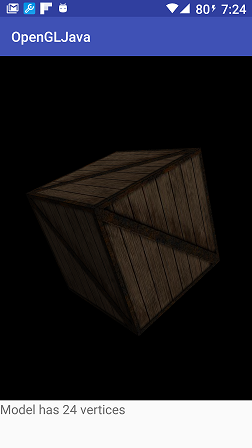

#OpenGL with Java 

A GL ES 3.0 app that loads a model in json format and renders it. It can deal with textures, and shaders in separate files (located in assets folder).

To create models in the required format  a [tool](https://github.com/lighthouse3d/Demos-and-Tools/tree/master/Assimp2JSON) is provided that reads models with [Assimp](http://www.assimp.org/) and writes the respective json file.

The starting point for this app was the code in [here](https://developer.android.com/training/graphics/opengl/index.html) from android developer web site. The added features are: 
* arcball to control camera
* texture loading
* model loading from json

Move a finger to rotate the box.

